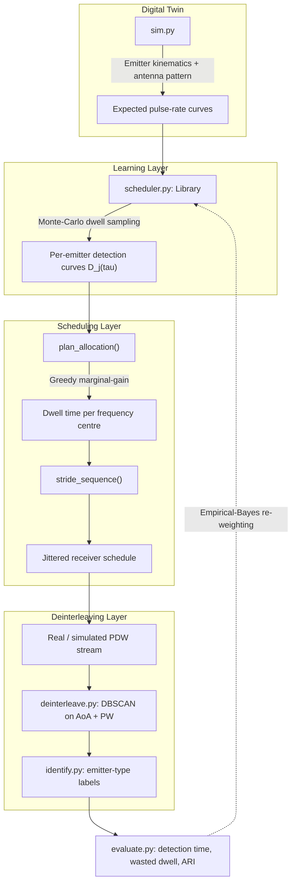

# 📡 SmartScan: ML-Based Radar Pulse Deinterleaving & Scan Scheduling

[](LICENSE)
[](https://www.python.org/downloads/)
[](#)
[](#)

**SmartScan** is an ML-driven receiver scheduling and pulse-deinterleaving pipeline built for **Smart India Hackathon 2026 — Problem Statement #26055**. Instead of scanning the spectrum blindly, SmartScan *learns* which frequency/spatial windows are worth dwelling on, schedules the receiver accordingly, and then untangles the resulting mix of overlapping pulses back into individual emitter tracks.

> ✏️ *Replace this line with the exact official title/organization of PS #26055 from the SIH portal.*

---

## 📖 Table of Contents

- [🔍 The Architecture: Sense → Learn → Schedule → Deinterleave](#-the-architecture-sense--learn--schedule--deinterleave)
- [✨ Core Intelligence Engine](#-core-intelligence-engine)
- [⚙️ Tech Stack](#️-tech-stack)
- [🛠 Installation & Setup](#-installation--setup)
- [🚀 Usage](#-usage)
- [📂 Project Anatomy](#-project-anatomy)
- [📈 Results](#-results)
- [🤝 Contributing](#-contributing)
- [📜 Code of Conduct](#-code-of-conduct)
- [⚖️ License](#️-license)
- [👥 Brought to You By](#-brought-to-you-by)

---

## 🔍 The Architecture: Sense → Learn → Schedule → Deinterleave



---

## ✨ Core Intelligence Engine

SmartScan-ML runs a four-stage loop (see `src/scheduler.py`):

1. **Learn (offline)** — For every emitter seen in training scenarios, Monte-Carlo sampling of random dwell chunks builds a detection curve `D_j(τ) = P(≥K pulses | τ seconds of in-band dwell)`. This is the learned prior over *what's out there and how hard it is to intercept*.
2. **Plan (offline)** — Greedy marginal-gain allocation decides how many seconds `τ_c` to spend at every candidate frequency centre, maximizing total expected detections across all emitters.
3. **Sequence** — Dwell chunks are stride-scheduled so every centre is revisited evenly (low latency), with jittered timing so the schedule never resonates with an emitter's own beam-rotation period.
4. **Adapt (online)** — An Empirical-Bayes update re-weights the prior curves using live detections, so empty bands are abandoned early and productive ones get extended dwell time.

Once pulses are collected, `deinterleave.py` clusters them by **Angle of Arrival + Pulse Width** (DBSCAN), splits multi-carrier clusters on frequency, and `identify.py` labels each recovered cluster with a radar function using a small feature vector (centre frequency, pulse width, PRI, spread, cluster size).

---

## ⚙️ Tech Stack

| Layer | Library / Tool |
|---|---|
| **Numerical core** | NumPy, SciPy |
| **Clustering / ML** | scikit-learn (DBSCAN, KNN, Isotonic Regression, RandomForest) |
| **Data format** | Custom dependency-free `.h5` reader (`mini_h5.py`) — `h5py` reference loader also included |
| **Prototype UI** | Static HTML/JS demo (`proto/`) built from `prototype_data.json` |
| **Language** | Python 3.10+ |

---

## 🛠 Installation & Setup

```bash
git clone https://github.com/ashishgupta12122007-cloud/deinterleaving-by-smart-scan.git
cd deinterleaving-by-smart-scan
python3 -m venv .venv
source .venv/bin/activate      # Windows: .venv\Scripts\activate
pip install -r requirements.txt
```

---

## 🚀 Usage

Run the full simulate → schedule → deinterleave → evaluate pipeline:

```bash
python src/run_all.py
```

Rebuild the interactive prototype/demo page used for the SIH pitch:

```bash
cd proto
python build.py
```

This reads `out/prototype_data.json` + `proto/template.html` and writes `proto/sih26055_smart_scan.html`.

---

## 📂 Project Anatomy

- **`src/sim.py`** — Digital twin: emitter kinematics, antenna gain pattern, and pulse-recording probability. Powers the `Twin` class used to score any dwell schedule in milliseconds.
- **`src/scheduler.py`** — SmartScan-ML itself: `Library` (learned detection curves), `plan_allocation()` (greedy scheduling), `stride_sequence()` (jittered timing).
- **`src/deinterleave.py`** — DBSCAN-based deinterleaver on (AoA, pulse width), plus cluster merging and ARI/recovery scoring.
- **`src/identify.py`** — Turns recovered clusters into emitter-type labels.
- **`src/evaluate.py`** — Detection-time curves, wasted-dwell fraction, and calibrated detection probabilities.
- **`src/data_io.py`** / **`src/mini_h5.py`** — Load `config_*.h5` scenario files (ToA, frequency, pulse width, AoA, amplitude + ground truth) without needing `h5py`.
- **`src/run_all.py`** — End-to-end pipeline entry point.
- **`proto/build.py`** — Builds the standalone interactive HTML demo from `out/prototype_data.json` + `proto/template.html`.
- **`out/`** — Generated schedules, allocations, and prototype data.
- **`docs/`** — Write-ups: `results.md`, `requirements.md`.

---

## 📈 Results

See [`docs/results.md`](docs/results.md) for scenario-by-scenario detection curves, time-to-detect, and wasted-dwell metrics.

---

## 🤝 Contributing

Contributions are welcome! See [CONTRIBUTING.md](CONTRIBUTING.md) for how to report issues and submit pull requests.

## 📜 Code of Conduct

This project follows a [Code of Conduct](CODE_OF_CONDUCT.md). By participating, you're expected to uphold it.

## ⚖️ License

Distributed under the **MIT License**. See [LICENSE](LICENSE) for details.

## 👥 Brought to You By

Built for **Smart India Hackathon 2026, Problem Statement #26055**.

> ✏️ *Add your team name, institution (e.g. CCET), teammates' names/GitHub handles, and mentor here.*

- **Team Name:** Interstellar
- **Project Name:** Aeges
- **Institution:** CCET
- **Team Members:** Ashish Gupta, Mradul Chaudary, Divesh Thakur, Ayush Ahuja, Mayank Garg 

Questions or want to collaborate? Open an [issue](../../issues).
